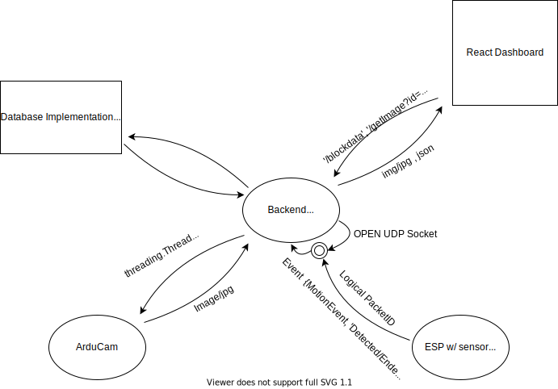
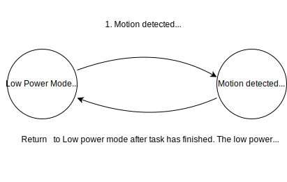

> Written with [StackEdit](https://stackedit.io/).`
> 

# ArduinoHomeSecurity

## Description

Embedded home security system which streams events to Reactjs dashboard. **(C/C++)** Independent embedded devices connected to PIR motion sensors and Serial Periphereal Cameras send events wirelessly to a **PYTHON** server. The server uses threads to access and snyc images and motion data into pairs and uses Flask to make the data accessible. The **ReactJS** dashboard consumes the data, renders the data using **React Hooks** and **CSS gridlayout**

# Architecture Diagrams 
- Activity https://go.gliffy.com/go/share/image/sr0pe8knaa19fgfq9qy1.png?utm_medium=live-embed&utm_source=custom 
- Sequence https://go.gliffy.com/go/share/image/slbc2iovuksl3v2gt6qo.png?utm_medium=live-embed&utm_source=custom

# Materials 

* ~~Elegoo ATmega2560-16u (16 analog out pins) with ATmega16u2 (same chip as official Arduino version)~~
  * ~~*future version will use a smaller board such as an Arduino nano*~~
* ~~ESP8266 wifi module~~ Much better design to use integrated ESP-12e  
* Node Micro Controller Unit with integrated ESP-12e wifi chip. ***NodeMCU** in these docs*
* Passive Infrared Sensor (PIR sensor) 
* ArdumCam Mini 2MP Plus camera 
* Arducam Mini 2MP Plus SPI (Serial Perepheral Image) camera 
* August Smart Lock *(not currently implemented)*

# Design Doc Specifications 
## LifeCylce Diagram of Security Event

## **Embedded Software ( C/C++ )**

Embedded device are used in this project to provide wirless data on events {motion detection, images, light sensors ... }. Presently, two sensors (Motion Dectection, Image Capture) are implemented with the NODE MCU (ESP12-E) board as presented in in the [Materials](#Materials) section.
### Motion Dectection 
* **PIR sensor** has a signal digital logic pin that outputs a HIGH signal when motion is detected and LOW signal when no motion is detected. Most sensors have two potentiometers ; one controls the sensivity/range of the sensor and the other controls the time between detections e.g. how long does the output remain HIGH after a detection.
* When the PIR is triggered , the NodeMCU sends a UDP packet to a python socket hosted on the backend server. The NodeMCU doesn't wait for confirmation and will continue to attempt to send packets despite powerlosses. The server and the ESPsensor can each be repeately restarted independent of each other and resume communication upon power up.
* Some functionality from the ESP8266WIFI library is abstracted into custom classes DeviceSever and UdpComm to separate logic and create a more readable and maintainble program. 
### ArduCam Mini 2MP plus camera
* The ArduCam camera communicated to the NodeMCU with a serial interface. 
* The built-in example source code for the cameras created corrupt and unreadible images. Upon research, a different version which produces readible images was found ; however, the http API did not produce browser readible images responses. 
* After some debugging, Images from the arducam can be accessed with a HTTP GET '/capture' request. 
* Every time a motion event is detected and read by the server, a **new thread** is produced which requests the image and writes it to the database. 
## **Backend Python Server**

* The python server uses Flask to create endpoints for the react frontent to consume. 
* The backend also uses a UDP socket, which ESP devices (e.g. NodeMCU ESP12-e) send event data to in real-time. 
* The backend can pair logically connected packets that arrive at different times.
  - E.g. "Motion Detected" and "Motion Ended" events would be logically paired. 
* Immediatley when a 'Motion Detected' event is received, a new thread is born which retrieves and saves an image from the AruCam device, without blocking new events from being recieved. However, if the ArduCam is offline or unavailable, no threads are created and an imageless event is published to the database without throwing any haulting errors. 

## **Reacet Dashboard**

The web page will display the video gathered from the Arducam camera along with the results of the analysis of the image processing server. The dashboard uses a CSS gridlayout to Layout different React Components for each type of information - e.g. A camera feed, a time stamp of entering. 

# Useful Additional Documentation
## Helpfull Documentation from the Internet Sea
* Pinout information for ESP devices {ESP8166, ESP12-e NodeMCU, Wemos D1 mini pinout} 
  - https://randomnerdtutorials.com/esp8266-pinout-reference-gpios/
* Architecture for built in LEDs (Pin,Sketch Pin Aliases,Resistance ...) 
  - https://lowvoltage.github.io/2017/07/09/Onboard-LEDs-NodeMCU-Got-Two

## Note on an Arduinos role 
The use Embedded micro-controllers like Arduinos should be limited to very specifc repeatble tasks, where fast I/O and unique analog sensors are required. For example, an arduino could be used with a passive infrared sensor (PIR) or a laser trip sensor to log both TimeIN/TimeOut of people entering a home. 

For an application such as image capture, there is not sufficient processing and memory capabilities to perform image analaysis (e.g. computer vision with OpenCV), nor to store logs of images. These images must be pushed to a server with more storage and compute such as a laptop or a rasberry pi. 
## FreeRTOS - Alternative Design for lower power use *(not implemented)*

 

`
